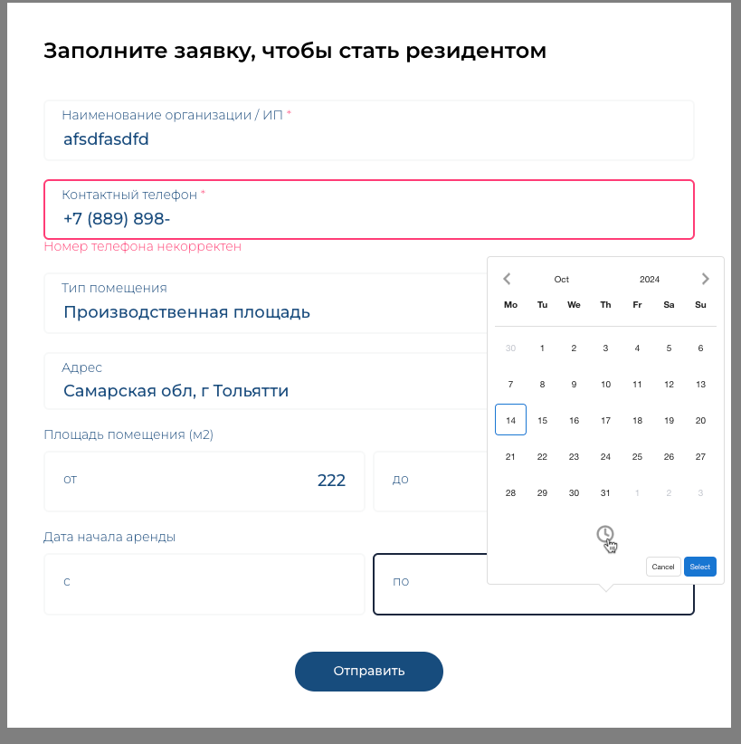

>#### NODE.JS 20.16
```sh 
yarn && yarn dev 
```
# Тестовое задание

###  Финальный результат

###  Валидация

###  Селект Multiple Default Mode

###  Тест формы

## Задание
>Задача заключается в следующем:

>1) Разработать форму в модальном окне. Для создания модального окна можно использовать модуль vue-final-modal.
>2) Настроить валидацию введенных данных. Для этого можно использовать библиотеку veevalidate.
>3) Обеспечить отправку данных на сервер и обработку возможных исключений.
>4) Обязательно добавить маску для ввода номера телефона.
>5) Создать компонент "base-select" с возможностью переключения режимов работы: множественный и одиночный выбор.
>6) Создать компонент "base-range" для ввода чисел в заданном диапазоне и дат.

><div><strong>Дополнительно, не обязательно, но будет плюсом:</strong></div>
>Добавить функцию автозаполнения части полей формы на основе данных из dadata.

> #### API куда слать запрос не было предоставлено
> Сделал просто обработку ошибок с эмуляцией отправки данных


## Особенности

- Base-range -> использует vuedatepicker для выбора дат [vuedatepicker]( https://vue3datepicker.com/)
- Для адреса используется сервис dadata -> интегрирован пакет [vue-dadata](https://www.npmjs.com/package/vue-dadata)
- Валидация вынесена в composable функцию
- vuei18n подключен 
- Сущности вынесены в namespace и туда подвязаны интерфейсы
- Плавные анимации/ховер/фокус и тп
- Для маски используется [maska]( https://www.npmjs.com/package/maska)
- Конфиг/линтера
